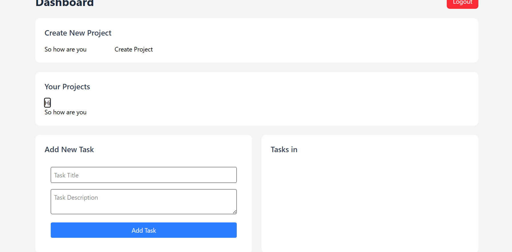

A full-stack web application to manage multiple users, each with projects and tasks, built using:

Frontend: ReactJS (Vite)

Backend: ExpressJS + NodeJS

Database: MongoDB (Mongoose)

Authentication: JWT (JSON Web Token)

Folder Structure
root/
├── backend/
│   ├── controllers/
│   ├── middleware/
│   ├── models/
│   ├── routes/
│   ├── server.js
│   ├── package.json
│   └── .env
├── frontend/
│   ├── frontend-app/
│   │   ├── src/
│   │   │   ├── components/
│   │   │   ├── context/
│   │   │   ├── hooks/
│   │   │   ├── pages/
│   │   │   ├── App.jsx
│   │   │   ├── main.jsx
│   │   │   └── api.js
│   │   ├── package.json
│   │   └── vite.config.js
└── README.md

Tech Stack
| Technology | Description |
|------------|-------------|
| ReactJS    | Frontend UI |
| ExpressJS  | Backend Server |
| MongoDB    | Database |
| Mongoose   | MongoDB ODM |
| Vite       | Fast frontend tooling |
| JWT        | Authentication |
| Axios      | HTTP Client |

Features
User Signup/Login (JWT Authentication)

Create a Project (max 4 projects per user)

Create, Read, Update, Delete (CRUD) Tasks

Task has Title, Description, Status, Date of Creation/Completion

Protect Routes with Middleware

Clean Code Structure

## React Hooks and Context for State Management

Setup Instructions
1. Clone the Repository
bash
Copy
Edit
git clone https://github.com/your-username/task-tracker-app.git
cd task-tracker-app

Backend Setup
bash

cd backend
npm install

Create a .env file inside /backend:

MONGO_URI=your_mongodb_connection_uri
JWT_SECRET=your_jwt_secret_key
PORT=5000

Run backend
npm run dev

Frontend Setup
cd frontend
npm create vite@latest frontend-app -- --template react
cd frontend-app
npm install
npm install react-router-dom axios

Run the frontend
cd frontend
npm create vite@latest frontend-app -- --template react
cd frontend-app
npm install
npm install react-router-dom axios

API EndPoint
| Method | Route | Description |
|--------|-------|-------------|
| POST   | /api/auth/signup | Register new user |
| POST   | /api/auth/login | Login user |
| GET    | /api/projects | Fetch all projects of user |
| POST   | /api/projects | Create new project |
| GET    | /api/tasks/:projectId | Fetch all tasks of a project |
| POST   | /api/tasks | Create new task |
| PATCH  | /api/tasks/:taskId | Update a task |
| DELETE | /api/tasks/:taskId | Delete a task |

# Image
